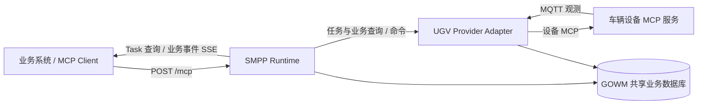
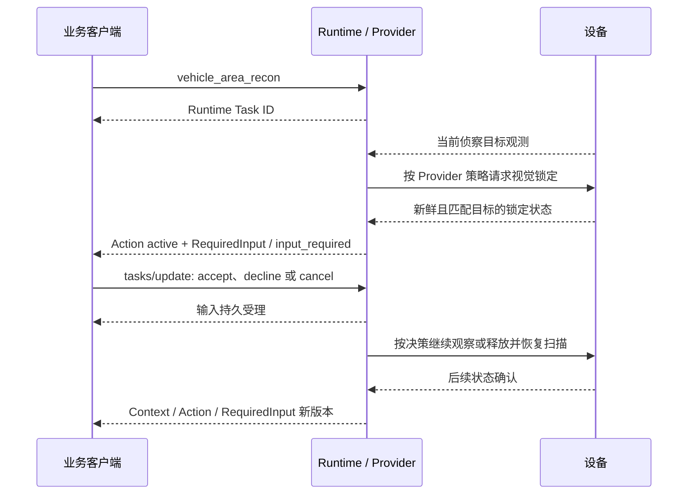

# UGV Provider MCP 服务接口与业务调用指南

本文面向接入 UGV 的业务后端、智能体和界面开发人员，说明如何通过 SMPP Runtime 调用车辆能力、管理长任务、读取业务对象和消费事件。

文档核对日期：2026-10-03；v1.3 实现提交为 `0a4a7c36865d4c9920a4e65857c0903e9ef12533`，已部署到 sz-gowm。配置和现场只读验证见[最新部署记录](../reports/ugv-business-simplification/SITE_DELIVERY.md)。所有请求示例都是调用模板；[实现验收记录](../reports/ugv-business-simplification/VALIDATION.md)基于本地受控设备夹具，部署后的健康和只读查询检查不代替新的现场业务链或 SDAR 联调验收。

建议阅读顺序：首次接入读第 1–4 节；导航及运行中调整读第 5 节；侦察和人工决策读第 6 节；界面接入读第 7 节的快照与事件；停止与排障读第 8–9 节。

业务调用顺序速查：

| 业务需求           | 调用顺序                                                                                                 | 需要保留或判断的结果                                              |
| ------------------ | -------------------------------------------------------------------------------------------------------- | ----------------------------------------------------------------- |
| 首次连接           | `server/discover` → `tools/list` → `vehicle_get_capabilities` → `vehicle_get_state`                      | 协议版本、资源 ID、工具 schema、执行模式和当前状态                |
| 导航               | `checkAvailability` → `vehicle_navigate` → `tasks/get`；有业务 Profile 时读取 `context/get`              | Runtime Task ID、路线引用、Task 终态和业务结果                    |
| 调整导航           | `context/get` → 读取可用 Intervention → `interventions/apply` → 刷新 Context / 消费事件                  | 命令受理之后，还需确认 `applied`、新计划版本及路线                |
| 区域侦察           | `vehicle_get_payload_status` → `checkAvailability` → `vehicle_area_recon` → `tasks/get` + Context / 事件 | 载荷健康、任务关联、覆盖与视场来源、当前 RequiredInput            |
| 回答观察决策       | `tasks/get` + `context/get` → `tasks/update` → 读取业务对象新版本                                        | 有效 request key、答复受理、后续设备状态；撤销提示不等于取消 Task |
| 独立跟踪           | `vehicle_get_targets` → `checkAvailability` → `vehicle_track_target` → `tasks/get`                       | 当前目标 ID、EO 通道可用性及实际锁定结果                          |
| 页面恢复           | 完整读取 `context/get` 分页 / 分块 → 用 `resumeFrom` 订阅业务事件                                        | 完整快照、公开游标、对象版本及去重标识                            |
| 暂停 / 恢复 / 结束 | 对原 Task 调用 pause / resume / `tasks/cancel` → `tasks/get`                                             | 暂停或恢复的执行子状态；取消后的终态确认                          |

表中 `vehicle_*` 均通过 `tools/call` 调用；缩写的业务方法使用后文列出的完整 `io.sdar/...` 名称。流程中的查询和状态检查可以重复，创建任务与提交业务命令须遵循各自的幂等规则。

## 1. 服务边界与部署参考



| 项目                                          | 最近部署记录值或协议约定                                                      |
| --------------------------------------------- | ----------------------------------------------------------------------------- |
| 对外业务入口                                  | `http://sz-gowm:19100/mcp`；`sz-gowm` 需由调用机解析，也可替换为可达主机地址  |
| 在 sz-gowm 本机访问                           | `http://127.0.0.1:19100/mcp`                                                  |
| 存活、就绪检查                                | `GET /health/live`、`GET /health/ready`                                       |
| Provider                                      | `isr.vehicle.ugv.ugv`                                                         |
| Runtime 资源 ID                               | `vehicle:ugv`                                                                 |
| 数据库设备 ID                                 | `ugv:ugv`，用于服务端持久化作用域，不替代请求的 `resourceId`                  |
| 对外协议版本                                  | `2026-07-28`                                                                  |
| TaskExecution / TaskBusiness / BusinessEvents | `1.0` / `1.0-rc2` / `1.0`                                                     |
| 执行模式                                      | 当前部署为 `live`；可省略模式头，不发送 simulation-id                         |
| 认证                                          | 当前为 `AUTH_MODE=development`，无凭据业务答复；旧版差异见第 2.4 节           |
| 业务存储                                      | GOWM 共享数据库 `ugv_smpp` schema，复用既有角色和绑定；客户端不直接访问业务表 |
| 地图反馈                                      | 启用估算视场扇形；不是经过标定的可见区域                                      |
| 发射能力                                      | `UGV_FIRE_ENABLED=false`，保持禁用；`UGV_FIRE_DISABLED` 是拒绝原因码          |

这里有两个不同的 MCP 服务：

- **业务调用入口**是 SMPP Runtime 的 `/mcp`，方法为 `vehicle_*`、`tasks/*` 和 `io.sdar/*`。
- **设备入口**是 Adapter 配置的 Device MCP 服务，其工具名包含 `ugv_area_recon_control` 等。普通业务客户端不应绕过 Runtime 直接控制设备，否则 Task、资源占用、业务上下文和设备状态可能失配。

当前 `/mcp` 由冻结协议路由处理，使用 `server/discover`，不是先发送传统 MCP `initialize`。`/mcp/legacy` 只有显式启用时才存在，不能混用两套协议的请求格式。服务不依赖 `Mcp-Session-Id`，恢复依靠持久 Task 和公开事件游标。

## 2. 请求格式与可复用调用函数

### 2.1 每次请求的公共约定

HTTP 使用 `POST /mcp`，请求体为单个 JSON-RPC 2.0 请求。

| 请求头                  | 规则                                                                                                                |
| ----------------------- | ------------------------------------------------------------------------------------------------------------------- |
| `Content-Type`          | `application/json`                                                                                                  |
| `Accept`                | 必须同时包含 `application/json, text/event-stream`                                                                  |
| `MCP-Protocol-Version`  | `2026-07-28`，与请求体版本一致                                                                                      |
| `MCP-Method`            | 与 JSON-RPC `method` 完全一致                                                                                       |
| `MCP-Name`              | `tools/call` 填工具名；任务查询、控制及 Context/Artifact/Intervention 方法填 `taskId`；事件关联任务查询填 `eventId` |
| `x-sdar-execution-mode` | `live` 或 `simulation`，必须匹配目标 Provider；省略时 Runtime 使用 `live`                                           |
| `x-sdar-simulation-id`  | 仅 `simulation` 时必填非空场景标识，同一 Task 保持一致；`live` 时不得发送                                           |
| `Authorization`         | 仅目标 Runtime 配置对应认证方式时发送合法 Bearer 凭据；`development` 策略由服务端确定，不能靠自填身份头改变         |

`server/discover`、`tools/list`、可用性查询无需 `MCP-Name`。`subscriptions/listen` 和 `io.sdar/businessEvents/listen` **不能带该头**。`snapshotParts/get` 和任务观测分页不强制该头，可省略。

`params._meta` 必须包含：

```json
{
  "io.modelcontextprotocol/protocolVersion": "2026-07-28",
  "io.modelcontextprotocol/clientInfo": {
    "name": "ugv-business-client",
    "version": "1.0.0"
  },
  "io.modelcontextprotocol/clientCapabilities": {
    "extensions": {
      "io.modelcontextprotocol/tasks": {},
      "io.sdar/taskBusiness": { "profileVersion": "1.0-rc2" },
      "io.sdar/businessEvents": { "profileVersion": "1.0" }
    }
  }
}
```

调用长任务和任务接口需要声明 Tasks 扩展；业务对象读写还需要 TaskBusiness 扩展；业务事件监听需要 BusinessEvents 扩展。客户端声明能力不会让服务端自动启用不存在的接口。

身份、执行模式、场景共同限定 Task 访问。创建任务后更换场景或身份，不能继续假定能读取、取消原任务。没有执行模式头时 Runtime 默认 `live`；它会与配置为 `simulation` 的 Provider 不匹配。模式表示协议执行上下文，不能根据“底层是软件仿真”自行推定应该发送哪个值。

### 2.2 Bash / curl 示例封装

需要 `bash`、`curl` 和 `jq`。下面函数只在显式调用 `ugv_rpc` 时发送请求；后续示例均复用它。`SMPP_TOKEN` 可留空。正式客户端应将场景标识与 Task ID 一起持久化。

```bash
# v1.3 普通接入默认 live；服务器必须运行匹配该模式的版本与配置。
export SMPP_MCP_URL='http://sz-gowm:19100/mcp'
export UGV_EXECUTION_MODE='live'
unset UGV_SCENE_ID

ugv_rpc() {
  local method="$1" params="${2:-\{\}}" name='' body
  local mode="${UGV_EXECUTION_MODE:-live}"
  local -a headers=(
    -H 'Content-Type: application/json'
    -H 'Accept: application/json, text/event-stream'
    -H 'MCP-Protocol-Version: 2026-07-28'
    -H "MCP-Method: $method"
    -H "x-sdar-execution-mode: $mode"
  )
  case "$mode" in
    simulation) headers+=(-H "x-sdar-simulation-id: ${UGV_SCENE_ID:?set UGV_SCENE_ID}") ;;
    live) ;;
    *) printf '%s\n' 'UGV_EXECUTION_MODE must be live or simulation' >&2; return 2 ;;
  esac
  case "$method" in
    tools/call) name="$(jq -r '.name' <<<"$params")" ;;
    tasks/get|tasks/update|tasks/cancel|io.sdar/taskExecution/tasks/pause|io.sdar/taskExecution/tasks/resume|io.sdar/taskBusiness/context/get|io.sdar/taskBusiness/artifacts/get|io.sdar/taskBusiness/interventions/apply)
      name="$(jq -r '.taskId' <<<"$params")" ;;
    io.sdar/businessEvents/relatedTasks/list)
      name="$(jq -r '.eventId' <<<"$params")" ;;
  esac
  [[ -z "$name" ]] || headers+=(-H "MCP-Name: $name")
  [[ -z "${SMPP_TOKEN:-}" ]] || headers+=(-H "Authorization: Bearer $SMPP_TOKEN")
  body="$(jq -cn --arg method "$method" --argjson p "$params" '{
    jsonrpc:"2.0", id:"ugv-example", method:$method,
    params:($p + {_meta:(($p._meta // {}) + {
      "io.modelcontextprotocol/protocolVersion":"2026-07-28",
      "io.modelcontextprotocol/clientInfo":{name:"ugv-business-client",version:"1.0.0"},
      "io.modelcontextprotocol/clientCapabilities":{extensions:{
        "io.modelcontextprotocol/tasks":{},
        "io.sdar/taskBusiness":{profileVersion:"1.0-rc2"},
        "io.sdar/businessEvents":{profileVersion:"1.0"}
      }}
    })})
  }')" || return
  curl --silent --show-error --no-buffer --max-time 30 \
    "${headers[@]}" --data-binary "$body" "$SMPP_MCP_URL"
}
```

所有 `<…>` 都是占位符，发送前必须替换为真实响应中的标识或值；不能把中文占位符作为 HTTP 请求头发送。普通响应检查 JSON-RPC `error`，不要只判断 HTTP 200。监听 SSE 时使用逐帧解析器；不能将整条连接按一个 JSON 解析。上面的 30 秒超时用于演示，SSE 被主动关闭不代表 Task 已取消。生产客户端并发请求应使用独立 JSON-RPC `id`。

### 2.3 首次接入顺序

```bash
curl --fail --silent http://sz-gowm:19100/health/ready
ugv_rpc server/discover '{}'
ugv_rpc tools/list '{}'
ugv_rpc tools/call '{"name":"vehicle_get_capabilities","arguments":{"resourceId":"vehicle:ugv"}}'
ugv_rpc tools/call '{"name":"vehicle_get_state","arguments":{"resourceId":"vehicle:ugv","include":["chassis","payload","health","targets"]}}'
```

从 `server/discover` 的 `result.capabilities.extensions["io.sdar/providerCatalog"]` 保存 Provider 标识和 `manifestHash`，从 `tools/list` 的 `result.tools[]` 读取每个 Tool：

- `name/inputSchema/outputSchema`：调用名称和参数、结果合同；不要给严格 schema 添加未声明字段。
- `_meta["io.sdar/taskExecution"]`：`taskBehavior`、`supportsCancellation`、`supportsPauseResume`、`supportsInputRequired`、`supportsScheduling` 等能力。
- `_meta["io.sdar/resourceBinding"]`：资源绑定信息。
- `_meta["io.sdar/taskBusiness"]`：若存在，读取 `methods`、`policy`、业务对象类型和版本；缺失时不调用其业务扩展。

`resourceId` 由 schema 的约束和实际资源配置确定，不能把模板默认值 `vehicle:ugv1` 硬编码到本次站点。

工具在清单中存在，只表示接口可发现，不表示当前能执行。设备能力、当前状态、通道占用及站点开关都可能限制调用。

### 2.4 执行模式、认证模式与版本差异

这两个配置维度相互独立：`UGV_EXECUTION_MODE` 决定请求执行上下文；`AUTH_MODE` 决定身份和业务答复策略。调用方不能通过工具参数选择服务器认证模式。

| 场景                                      | 请求约定                                                   | 业务答复行为                                                                                |
| ----------------------------------------- | ---------------------------------------------------------- | ------------------------------------------------------------------------------------------- |
| 历史 v1.2，`AUTH_MODE=development`        | 无凭据查询和创建任务；按部署记录发送 `simulation` 与场景头 | 匿名没有受信人工身份，`user_required` Input 与受信 Intervention 仍可能被拒绝                |
| 当前部署 v1.3，`AUTH_MODE=development`    | 不需要登录、JWT 或角色字段；执行模式按 Provider 配置       | Runtime 生成内部 `development_anonymous` 标记，允许走业务答复策略；不表示真实人工身份已验证 |
| `AUTH_MODE=anonymous`                     | 服务端使用共享匿名授权域                                   | 与 `development` 不同，不生成上述开发答复标记                                               |
| `AUTH_MODE=jwt_hs256` / `trusted_headers` | 由既有身份系统或受信代理提供有效身份，保持 Task 授权域一致 | 按已验证 responder 与请求策略检查；普通客户端自填 user 角色不能替代认证                     |

当前 v1.3 开发策略保留 Task/Execution 绑定、有效请求、期限、版本、对象绑定和命令幂等检查；它不是取消业务守卫。客户端不要提交内部 `verifiedResponder`、`runtime_development_policy` 等字段。sz-gowm 已升级并通过健康和只读查询验证；完整 SDAR 联调另行记录。

配置为 `live` 的实例采用下面的客户端设置即可；封装函数不会发送场景头：

```bash
export UGV_EXECUTION_MODE='live'
unset UGV_SCENE_ID
```

旧版或显式 `simulation` 实例使用下列可选配置：

```bash
export UGV_EXECUTION_MODE='simulation'
export UGV_SCENE_ID='ugv-client-session-001'
```

`simulation` 实例必须显式设置模式和非空场景 ID。不要在同一个 Task 的查询、更新或取消中切换模式。发射开关独立于认证、执行模式，本站保持 `UGV_FIRE_ENABLED=false`。

## 3. 工具清单与参数

既有站点验收记录中的清单包含下表前 10 项，包含已禁用的发射工具；`vehicle_laser_range` 是条件性工具，不能由此假定本站已发布。清单数量和可用性应以接入时的 `tools/list` 与检查结果为准。

| Tool                         | 返回方式            | 必需参数（均需 `resourceId`）               | 用途与注意事项                                                                   |
| ---------------------------- | ------------------- | ------------------------------------------- | -------------------------------------------------------------------------------- |
| `vehicle_get_state`          | 同步                | `resourceId`                                | 归一化状态；可选 `include` 为 `chassis/payload/health/targets` 的不重复数组      |
| `vehicle_get_capabilities`   | 同步                | `resourceId`                                | 设备能力、导航方式、载荷能力及其来源；不是当前可用性预约                         |
| `vehicle_get_payload_status` | 同步                | `resourceId`                                | 侦察、云台、锁定状态与载荷错误                                                   |
| `vehicle_get_targets`        | 同步                | `resourceId`                                | 本车传感器观测目标及新鲜度；不是全局目标真值                                     |
| `vehicle_navigate`           | Task                | `resourceId, mission`                       | 导航，支持的任务变体由 schema 决定                                               |
| `vehicle_area_recon`         | Task                | `resourceId, scanMode`；区域模式另需 `area` | 区域或环视侦察；业务反馈按 Profile 启用                                          |
| `vehicle_track_target`       | Task                | `resourceId, targetId`                      | 独立视觉跟踪任务，`targetId` 为 1–128 字符字符串；不是侦察任务里的业务 Action ID |
| `vehicle_control_gimbal`     | Task                | `resourceId, mode`                          | 有限时长的云台调整；当前支持 `absolute/relative/reset`                           |
| `vehicle_fire_weapon`        | Task 接口，本站禁用 | 本指南不提供发射调用步骤                    | 即使列出也不能视为可用；收到 `UGV_FIRE_DISABLED` 保持禁用，不通过重试绕过        |
| `vehicle_emergency_stop`     | Task                | `resourceId`                                | 停止本车局部通道；不能代替正常业务取消；不支持再取消这个停止任务                 |
| `vehicle_laser_range`        | 条件性同步接口      | `resourceId`                                | 仅发现后使用；结果为 `distanceM, valid, observedAt` 等                           |

### 3.1 同步查询的结果读取

成功工具结果位于 JSON-RPC `result.structuredContent`，同步调用的 `resultType` 为 `complete`。先判断 `isError`，再按该 Tool 的 `outputSchema` 处理内容。

- **车辆状态**：包含 `identity`、`connectivity`、`freshness`、`revision`、`observedAt`、`mqttIngressSequence`，以及选中的状态域。
- **载荷状态**：包含 `online`、`reconnaissance`、`eoTask`、`weapon`、可选 `gimbal/laser/lockedTargetId`、`payloadErrorCodes` 等。
- **目标查询**：包含 `resourceId, targets, freshness, observedAt`；空数组不能推出“区域内不存在目标”，更不能证明传感器无故障。
- **测距**：`valid=false` 时不能把数值当作有效测量；字段缺失不应补成零。

同步查询示例：

```bash
ugv_rpc tools/call '{"name":"vehicle_get_payload_status","arguments":{"resourceId":"vehicle:ugv"}}'
ugv_rpc tools/call '{"name":"vehicle_get_targets","arguments":{"resourceId":"vehicle:ugv"}}'
# 只有 tools/list 已发布测距接口时调用：
ugv_rpc tools/call '{"name":"vehicle_laser_range","arguments":{"resourceId":"vehicle:ugv"}}'
```

返回时间 `observedAt` 不总是设备原始观测时间；例如载荷查询的该值在服务端查询时产生。判断新鲜度还应结合状态的 `freshness`、目标自身时间、业务对象来源和可用性结果，不能因为刚调用查询就认为缓存字段全部新鲜。

设备接口 `ugv_area_recon_get_status` 的 `load_status` 被归一化为载荷查询结果的 `reconnaissance.loadStatus`；`camera_fault` 对应 `reconnaissance.cameraFault`。`loadStatus=4` 的来源是设备载荷状态，不是导航接口。相机故障与载荷故障字段不同，应结合 `loadStatusLabel`、错误码和源时间判断，不能用 `cameraFault=false` 覆盖载荷故障。

### 3.2 标准业务语义

`vehicle_get_state`、`vehicle_get_payload_status`、`vehicle_get_targets` 新增 `businessSemantics`，包含 `missionTaskState`、`reconPhase`、`visualLockState`、`sensorMode`、`payloadHealth` 和 `payloadLoadState`。客户端可直接展示这些稳定枚举；`native` 与原查询字段保留设备码。

侦察 Context 的 `summary.properties.businessSemantics` 与状态事件复用同一映射。未知码显示 `unknown`，不以零值或旧值替代；新鲜度、任务关联强度和 Task 终态仍独立判断。完整字段、码表依据及示例见[UGV 业务语义投影合同](providers/ugv-business-semantics.md)。当前 sz-gowm v1.3 已返回该字段；其他旧部署须升级后才会返回。

### 3.3 导航参数

`mission` 是以下互斥结构之一；只有当前 `inputSchema` 中出现的变体才能使用。

| `mission.type` | 结构                                                 | 限制                                                      |
| -------------- | ---------------------------------------------------- | --------------------------------------------------------- |
| `point`        | `target: {longitude, latitude, altitude?}`           | 经纬度范围分别为 ±180、±90                                |
| `route`        | `waypoints: [{longitude, latitude, altitude?}, ...]` | Manifest 允许 1–1024 点；具体规划流程还可能施加更严格限制 |
| `distance`     | `direction, distanceM`                               | 方向为 `forward/backward/left/right`；距离 > 0            |
| `return_home`  | 无其他 mission 字段                                  | 不接受客户端虚构的返航坐标                                |

顶层可选 `speedLimitKmh > 0`、`stopOnObstacle: boolean`。当 schema 发布规划参数时，还可使用 `planningMode: auto/road_network/direct`、`density: adaptive/dense/medium/sparse`。业务调整规划的 `waypoints` 为 1–64 点，和原始导航 schema 上限不同。

坐标字段为 `longitude/latitude`，不是 `lon/lat`；速度为 km/h，距离为 m。JSON 坐标对象的键顺序无关；若读取 GeoJSON 数组，其坐标顺序为 `[longitude, latitude]`，并须遵循 Artifact 的坐标系与转换声明。

### 3.4 侦察参数

当前 UGV 使用 `circularScanOmitsArea=true` 的 schema；不要套用其他车辆 Provider 的 `zoom/stopOnTarget` 等参数。

| 字段                   | 类型、范围                                | 说明                                                 |
| ---------------------- | ----------------------------------------- | ---------------------------------------------------- |
| `scanMode`             | `area` 或 `circular`，以清单为准          | 必填；当前 UGV 不发布旧版 `sector` 参数形式          |
| `area.polygon`         | 至少 3 个 `{longitude, latitude}`         | `area` 模式必填；环视模式可省略                      |
| `scanCount`            | 整数 0–1000                               | 可选；0 是设备的特殊扫描次数值，不能按“一次完成”解释 |
| `regionType`           | 整数 2、3、4、5                           | 可选，沿用设备区域类型枚举；不要自行解释其几何含义   |
| `targetTypes`          | 非负整数数组，最多 128 项                 | 可选，设备类型编码；不是字符串类别数组               |
| `lockDurationLimitSec` | 非负整数                                  | 可选，单位秒                                         |
| `reconType`            | 1/2/3/4 或 `adaptive/visible/infrared/dc` | 可选，按设备能力选择                                 |
| `scanSpeed`            | 正数                                      | 可选，单位/能力以设备契约为准                        |
| `scanPitch`            | -90 至 90                                 | 可选，仅发布环视支持时出现                           |

区域覆盖率、当前视场、目标发现是不同对象：覆盖率 100% 不保证当前有目标，也不保证估算视场可用。侦察是否完成按 Task 与新鲜设备状态判断，不能单看覆盖数字。

### 3.5 云台与停止

`vehicle_control_gimbal` 的 `mode` 为 `absolute/relative/reset`；非 reset 模式至少提供 `yaw`、`pitch`、`deltaZoom` 之一。`yaw` 范围 ±180，`pitch` 范围 ±90，可选 `yawSpeed/pitchSpeed` 必须为正数。即使底层设备支持连续 `velocity`，当前对外 schema 也没有发布该模式。

云台示例（先确认 EO 通道可用）：

```bash
ugv_rpc tools/call '{
  "name":"vehicle_control_gimbal",
  "arguments":{"resourceId":"vehicle:ugv","mode":"relative","yaw":5,"pitch":-2},
  "_meta":{"io.sdar/taskExecution":{"profileVersion":"1.0","idempotencyKey":"gimbal-adjust-001"}}
}'
```

保存返回的 Task ID，再查询其终态。需要回中时使用 `mode=reset`，不沿用上次调整的幂等键。独立云台控制与侦察自动锁定共享 EO 资源，不在已由侦察管理的锁定过程中额外提交。

`vehicle_emergency_stop` 会抢占本车通道。返回 Task 后仍需查询最终状态；“停止命令已接收”不等于已证明底盘静止、侦察终止及锁定释放。

## 4. 可用性检查、幂等与任务结果

### 4.1 检查即将提交的具体参数

```json
{
  "profileVersion": "1.0",
  "checks": [
    {
      "requestId": "nav-preflight-001",
      "operationName": "vehicle_navigate",
      "arguments": {
        "state": "complete",
        "value": {
          "resourceId": "vehicle:ugv",
          "mission": {
            "type": "point",
            "target": { "longitude": 106.81312856, "latitude": 29.72041222 }
          }
        }
      }
    }
  ]
}
```

把上述对象作为 `ugv_rpc io.sdar/taskExecution/checkAvailability` 的第二个参数。当前冻结接口每批 **1–64** 项，`requestId` 不得重复。未知参数可用 `arguments.state=partial`，同时提供 `knownValue` 与非空 `unresolvedPaths` JSON Pointer 数组。

返回状态为 `available/restricted/disabled/unknown`。结合 `reasonCode`、检查时间和有效期处理；`unknown` 不是允许执行。检查不预占通道，提交时仍会重新检查。接口传输失败不会转换成“可用”。

### 4.2 工具调用幂等

幂等键放在 `params._meta["io.sdar/taskExecution"]`，不能放进工具 `arguments`：

```json
{
  "profileVersion": "1.0",
  "idempotencyKey": "nav-order-20260930-001",
  "timing": {
    "start": { "mode": "immediate", "startToleranceMs": 0 },
    "maxElapsedMs": 300000
  }
}
```

相同身份、模式、场景、操作及相同参数的重试使用相同键，返回原调用结果或原 Task。改变参数应使用新业务请求标识，不能复用旧键。HTTP 超时后不要立即换键重发，以免重复创建任务。

`maxElapsedMs` 是执行期限，不是客户端 HTTP 超时，也不是 Task 保留期 `ttlMs`。超时会触发协作停止，并等待后续状态确认。需要预约且工具支持时，`start.mode=scheduled`，另带有时区的 RFC3339 `scheduledAt` 与 `startToleranceMs`；不支持该能力的工具不能套用。

### 4.3 创建和查询结果

长任务创建成功，直接读取 `result.taskId`，不是 `result.task.taskId`。创建结果的主要字段为：

```json
{
  "resultType": "task",
  "taskId": "<Runtime Task ID>",
  "status": "working",
  "createdAt": "2026-09-30T08:00:00.000Z",
  "lastUpdatedAt": "2026-09-30T08:00:00.000Z",
  "ttlMs": 3600000,
  "pollIntervalMs": 1000
}
```

以上时间、轮询周期和 TTL 只是形状示例，实际值以响应为准。当前冻结端点字段是 **`ttlMs/pollIntervalMs`**，不要使用旧版 SDK 文档中的顶层别名。

```bash
ugv_rpc tasks/get '{"taskId":"<Runtime Task ID>"}'
```

`tasks/get` 的 JSON-RPC `result` 本身是 Task 快照，`resultType=complete` 表示这次查询完成，不表示任务完成。

| Task `status`    | 处理方式                                                                                              |
| ---------------- | ----------------------------------------------------------------------------------------------------- |
| `working`        | 按返回 `pollIntervalMs` 轮询；通过 `_meta["io.sdar/taskExecution"].substate` 区分执行、暂停、停止中等 |
| `input_required` | 读取 `inputRequests` 与业务 Context，只处理当前有效请求                                               |
| `completed`      | 读取 Task 的 `result`；继续检查 `isError` 和 `structuredContent` 的业务结论                           |
| `failed`         | 读取 Task `error`，这是技术失败；不要伪装为业务成功                                                   |
| `cancelled`      | 取消终态已确认；不要根据先前取消 Ack 提前宣告终止                                                     |

一个业务失败或部分结果也可能表现为 MCP `completed`，因此“HTTP 200 → complete → completed”都不是单独的业务成功条件。Task 终态写入后不会因迟到消息回到运行态。此版本不使用 `tasks/result` 读取结果。

## 5. 导航业务流程：启动、运行中调整、结束

### 5.1 启动导航

先读取能力、状态并用**同一组参数**检查可用性，然后提交：

```bash
ugv_rpc tools/call '{
  "name":"vehicle_navigate",
  "arguments":{
    "resourceId":"vehicle:ugv",
    "mission":{
      "type":"point",
      "target":{"longitude":106.81312856,"latitude":29.72041222}
    },
    "speedLimitKmh":5,
    "stopOnObstacle":true,
    "planningMode":"auto",
    "density":"adaptive"
  },
  "_meta":{"io.sdar/taskExecution":{
    "profileVersion":"1.0",
    "idempotencyKey":"nav-order-20260930-001",
    "timing":{"start":{"mode":"immediate","startToleranceMs":0},"maxElapsedMs":300000}
  }}
}'
```

这是有副作用的调用模板。保存返回的 Runtime `taskId`，不要使用底层 `mission_id` 调用 `tasks/get`。

规划与路线采用由 Provider 基于现有规划和任务重新执行完成。业务方通过 Context 的 `effectivePlanRevision`、`activeRefs.route` 与对应 Artifact 跟踪结果。**请求目的地、规划路线、实际轨迹、已采用路线**分别表达不同事实，不能把起终点直线或轨迹冒充规划结果。

### 5.2 读取路线与轨迹

```bash
ugv_rpc io.sdar/taskBusiness/context/get '{"taskId":"<Task ID>","maxPageBytes":65536}'
```

从 `result.snapshot` 读取 Context 和对象页，从 `activeRefs` 找当前路线、轨迹等精确版本。按第 7 节完成所有分页和大对象读取，再从 `result.resumeFrom` 监听增量事件。导航运行期间继续 `tasks/get`；事件流不能替代最终任务查询。

### 5.3 运行中调整路线

只有发现 Profile 支持 `interventionApply`，并且当前 Context 发布 `navigation.adjust_plan`、状态为 `available` 的 Intervention 时，才能提交调整。最近部署记录中导航调整已启用，侦察区域调整仍为关闭状态。

从当前对象读取 `interventionId/revision`、Context 的 `effectivePlanRevision` 和 `identity.executionId`，根据该对象的 `inputSchema` 组织参数：

```json
{
  "schemaVersion": "sdar.runtime-intervention-command/1.0-rc2",
  "commandId": "nav-adjust-001",
  "taskId": "<Task ID>",
  "executionId": "<Context identity.executionId>",
  "interventionId": "<当前 available Intervention ID>",
  "guard": {
    "mode": "semantic",
    "expectedInterventionRevision": 1,
    "expectedEffectivePlanRevision": 1
  },
  "input": {
    "waypoints": [{ "longitude": 106.81305, "latitude": 29.71914 }],
    "density": "adaptive"
  }
}
```

上述对象是 `io.sdar/taskBusiness/interventions/apply` 的 `params`；示例中的两个 revision 必须替换成读取值。`input` 使用 `waypoints`，不是 `mission`、`destination` 或设备 mission ID。答复者策略按第 2.4 节对应版本执行；部署版本的受信身份要求不能通过客户端自填角色字段绕过。

处理顺序：

1. 保存 `commandId`；网络不确定时只重试同一命令和内容。
2. `receipt.durablyAccepted=true` 仅表示 Runtime 持久接收，`businessApplied=false` 不能在界面上显示“路线已切换”。
3. 消费同一 Intervention 的 `submitted → applying → applied`，或 `failed/withdrawn` 等结果。
4. 成功还需读到新 `effectivePlanRevision` 与新路线精确引用；`applied` 结果中的引用要能解析。
5. 连续第二次调整必须读取新可用入口与新计划版本；不能复用已消费的 Intervention。

计划版本冲突时重新读取 Context，不能只在原请求上盲增 revision。相同 `commandId` 更改内容会冲突；前一业务变更未结束时不能并发提交另一个调整。

### 5.4 结束判定

导航正常结束时，结合 Task 业务结果中的 `destinationDistanceM`、`finalSpeedKmh`、`stationaryAtCompletion`、路线引用及来源关联强度解释结果。缺失字段不补零，命令 Ack 不等于到达。异常停止、取消、运行期限到达分别保留原始原因。

## 6. 侦察业务流程与人工观察决策

推荐顺序为：查询载荷 → 检查可用性 → 创建侦察 Task → 读取覆盖与视场 → 消费业务对象变化 → 按授权处理 RequiredInput → 等待结束或取消。

### 6.1 启动区域侦察

```bash
ugv_rpc tools/call '{
  "name":"vehicle_area_recon",
  "arguments":{
    "resourceId":"vehicle:ugv",
    "scanMode":"area",
    "area":{"polygon":[
      {"longitude":106.81271124,"latitude":29.71821513},
      {"longitude":106.81268055,"latitude":29.71864445},
      {"longitude":106.81323289,"latitude":29.71869495},
      {"longitude":106.81345382,"latitude":29.71816462}
    ]},
    "scanCount":1,
    "reconType":"adaptive"
  },
  "_meta":{"io.sdar/taskExecution":{
    "profileVersion":"1.0",
    "idempotencyKey":"recon-order-20260930-001",
    "timing":{"start":{"mode":"immediate","startToleranceMs":0},"maxElapsedMs":300000}
  }}
}'
```

坐标沿用本项目示例区域，不构成“当前位置一定可覆盖”的承诺。范围不可达、姿态数据不新鲜或载荷故障时，应处理相应不可用状态；不要把无目标直接解释为接口错误。

### 6.2 区域、覆盖、当前视场与目标

| 业务信息      | 读取与展示原则                                                                    |
| ------------- | --------------------------------------------------------------------------------- |
| 观察区域      | 读取 Context 的区域 Artifact，表达请求区域                                        |
| 覆盖范围      | 读取设备上报的覆盖 Artifact，不用轨迹填充未观测区域                               |
| 当前视场      | 本站为基于探测距离、可视角、位置和姿态的估算扇形，展示 `estimated` 来源与有效时间 |
| 观测目标      | 同步查询可用于概要；任务归属、业务版本和轨迹以绑定 Task 的 Context/事件为准       |
| Action        | 记录实际观察到的视觉锁定等动作及阶段；不是另一个可直接调用的工具名称              |
| RequiredInput | 当前业务决策请求，有独立 request key、版本、期限和关联会话                        |

Map-full 不是一个工具名，也不是任意给 `tools/call` 增加 `mapFull=true`。它由服务端 Profile 启用相应业务对象。估算输入缺失、过期或关联失败时，应显示不可用原因，不能继续把旧扇形画成“当前可视”。最近部署允许最多 3000 ms 的未来来源时间偏差，过期阈值仍为 3000 ms；调用方不自行扩大门限。

侦察设备可能没有完整 mission/session 字段。当前实现可发布 `INFERRED_CURRENT_EXECUTION`，表示受限的当前执行关联推断，**不是设备明确提供的严格关联**。保存原关联强度和来源，不把它改写为 `STRICT_CORRELATED`，不把上一任务的目标、覆盖或锁定事件移到新任务下。

### 6.3 RequiredInput 的读取与答复

当 Task 为 `input_required` 时，同时读取 `tasks/get` 响应的 `result.inputRequests` 和当前 RequiredInput 对象，核对 `requestId`、`requestKey`、revision、deadline 与关联会话。`inputRequests` 是以 request key 为键的对象，不是数组；遍历其键得到 `inputResponses` 的键。请求可能因目标丢失、会话更换、超时或任务结束而失效。

当前观察决策的接受形状如下，方法为 `tasks/update`：

```json
{
  "taskId": "<Task ID>",
  "inputResponses": {
    "<从 inputRequests 读取的 requestKey>": {
      "action": "accept",
      "content": { "decision": "continue_observation" }
    }
  }
}
```

这是**非发射的继续观察决策**。其他两种答复形状：

```json
{
  "declineExample": { "action": "decline" },
  "dismissExample": { "action": "cancel" }
}
```

后一个 JSON 仅展示两个 response 值，不能把 `declineExample/dismissExample` 当作实际 request key。`tasks/update` 不接受客户端自填 `respondedBy`、`actorId`、`expectedRequestRevision` 或任意额外字段；Runtime 根据锁定请求及可信认证上下文处理。

答复权限按第 2.4 节区分版本：历史 v1.2 对 `user_required` 要求受信人工身份；当前部署 v1.3 的 `development` 模式使用服务端生成的匿名开发策略答复。其他认证模式的受信身份要求继续保留。客户端发送的 `tasks/update` JSON 形状相同，不添加角色或内部审计字段。

`tasks/update` 返回 `resultType=complete` 仅是 Runtime 受理。继续读取该 RequiredInput 的新版本：接受对应 `answered`，拒绝对应 `declined`，撤销提示对应带回答的 `cancelled`。之后仍需根据业务对象和设备状态确认实际后续行为。

**Input 的 `action=cancel` 是撤销本次提示，不是取消整个侦察 Task。** 本站 Profile 的 `onDismiss/onExpire` 为 `release_and_resume_scan`；实际采用哪个处理策略，以当前请求和服务端 Profile 为准。终止侦察必须使用第 8.1 节的 `tasks/cancel`。

业务状态顺序如下；每个箭头都需要新的有效对象或观测，不能仅凭命令 Ack 前进：



### 6.4 独立跟踪与自动观察动作的区分

`vehicle_track_target` 使用 `{resourceId, targetId}` 创建独立 Task；目标 ID 必须来自当前有效设备观测，不能用业务 Artifact/Action ID 替代。它不支持 pause/resume，支持取消。Task 或 Action 的“已请求”不等于实际锁定，结果应按 Provider 发布的状态读取。

独立跟踪示例（此处 `<TARGET_ID>` 必须替换为新鲜目标观测的实际 ID）：

```bash
ugv_rpc tools/call '{
  "name":"vehicle_track_target",
  "arguments":{"resourceId":"vehicle:ugv","targetId":"<TARGET_ID>"},
  "_meta":{"io.sdar/taskExecution":{
    "profileVersion":"1.0","idempotencyKey":"track-order-001",
    "timing":{"start":{"mode":"immediate","startToleranceMs":0},"maxElapsedMs":60000}
  }}
}'
```

查询返回 Task，结合最终业务 `status`（例如 `target_locked/target_lost/cancelled/timeout`）解释结果。不要将“独立跟踪 Task 完成”解释为侦察决策请求也已被回答。

最近部署的侦察 Profile 的 `visualLockOwner=provider`，由 Provider 管理其内部观察动作。不要在收到业务 Action 后再重复提交独立跟踪或云台任务；这些能力使用同一 EO 通道，可能造成竞争。是否允许并发由当前可用性和配置决定，客户端不绕过通道仲裁。

## 7. 业务 Context、Artifact 与事件流

### 7.1 公共业务方法

下表参数均另需公共 `_meta`；响应需检查 JSON-RPC 错误。

| 方法                                       | 参数                                                                                                      | 主要响应                                             |
| ------------------------------------------ | --------------------------------------------------------------------------------------------------------- | ---------------------------------------------------- |
| `io.sdar/taskBusiness/context/get`         | `taskId`；可选 `maxPageBytes`（1024–1048576，默认 65536）、`pageCursor`                                   | `snapshot, resumeFrom`；大对象时另有 `snapshotToken` |
| `io.sdar/taskBusiness/snapshotParts/get`   | `taskId, snapshotToken`；可选 `objectRef, offset, maxBytes`                                               | `part`；用于恢复 Context 或精确对象版本              |
| `io.sdar/taskBusiness/artifacts/get`       | `taskId, artifactId`；可选 `revision, representationName, includeContent, contentOffset, maxContentBytes` | `artifact` 及按需内容块                              |
| `io.sdar/businessEvents/listen`            | `cursor` 与 `startPosition` 必须二选一；从快照恢复时传 `resumeFrom` 作为 `cursor`                         | POST SSE 业务事件流                                  |
| `io.sdar/taskBusiness/interventions/apply` | 第 5.3 节的扁平命令对象                                                                                   | `receipt`，不是新路线的成功结果                      |

### 7.2 快照读取与大对象

1. `context/get` 首次不传 `pageCursor`，保存 `snapshot.contextRevision` 和返回的公开 `resumeFrom`。
2. 若 `snapshot.nextCursor` 存在，原样作为下一页 `pageCursor`；所有页必须属于同一 Context 版本和一致的公开游标。
3. 读取 `snapshot.objects` 的精确版本。若存在 `contextDescriptor` 或 `objectDescriptors`，使用该页返回的 `snapshotToken` 调用 `snapshotParts/get`。
4. Context 分块不传 `objectRef`；业务对象分块传 descriptor 中的完整 `{kind,id,revision}`。按返回偏移连续组装 Base64 内容，校验长度和完整 SHA-256，再解析 JSON。
5. 完成所有页和分块后才能建立初始业务读模型，然后接续事件流。

Artifact 内容读取示例：

```json
{
  "taskId": "<Task ID>",
  "artifactId": "<activeRefs 中的 Artifact ID>",
  "revision": 3,
  "includeContent": true,
  "contentOffset": 0,
  "maxContentBytes": 65536
}
```

该对象作为 `artifacts/get` 参数；revision 必须替换成真实引用版本。外部内容按返回的下一偏移读取并校验，单块上限 1048576 字节。`includeContent=false` 时不能再传内容分页参数。内联、外部引用和不可用 Artifact 分别处理，不能把“有 metadata”解释成内容已完整可读。

### 7.3 接续 SSE

```json
{
  "cursor": {
    "streamId": "<context/get 返回的 resumeFrom.streamId>",
    "afterSequence": "<context/get 返回的 resumeFrom.afterSequence>"
  }
}
```

将该对象作为 `io.sdar/businessEvents/listen` 参数，不设置 `MCP-Name`。没有快照游标、仅需从流位置开始时，可改用 `{"startPosition":"latest"}` 或 `{"startPosition":"earliest_available"}`；它们与 `cursor` 互斥。业务页面恢复应优先使用快照游标，避免遗漏快照和订阅之间的变化。

按 SSE 帧中的 `data` 解析 JSON-RPC 通知。业务通知方法为 `notifications/io.sdar/businessEvents`，任务业务源为 `vehicle.business`，外层 `eventType` 为 `vehicle.business.changed`，具体变化位于 `rawPayload.kind/payload`。

需要处理 `BUSINESS_EVENT`、`ARTIFACT_CHANGED`、`ACTION_CHANGED`、`REQUIRED_INPUT_CHANGED`、`INTERVENTION_CHANGED`、`CONTEXT_FINALIZED` 等类型，以发现 Profile 和当前合同为准。

消费规则：

- 监听可能包含其他 Task 的授权事件，按已授权 Task/Execution 身份过滤；不能把全流当成单任务专属流。
- 公开 `streamId/sequence`（对应 `resumeFrom`）用于断线续传；Provider 的 `sourceId/sourceStreamId/sourceSequence` 只作来源追踪，不能替代公开游标。
- 按事件 ID/message ID 去重；Context 元数据按 Context revision 更新，对象按对象 revision 更新。多个事件可以共享同一 Context revision，不能仅凭 revision 相同就全部丢弃。
- 高版本引用的完整对象尚未读取时，标记未解析并刷新快照；不继续把低版本内容显示为最新。
- 遇到 stream reset、cursor expired、代际连续性变化或缺失对象，重新获取完整快照后再接续，不自行计算游标。
- `CONTEXT_FINALIZED` 后不把迟到事件当作新活动；最终业务归档与 Task 终态分别保留。

可复用现有只读消费实现：[`read-only-probe.ts`](../scripts/task-business/read-only-probe.ts) 和 [`task-business-reducer.ts`](../packages/mcp-protocol/src/task-business-reducer.ts)。将客户端的 execution-mode/scene 头一并传入，避免使用另一个授权上下文读取原 Task。

### 7.4 Task 状态通知与业务事件的区别

只需 Task 状态变化时，可用单独的 SSE 接口：

```bash
ugv_rpc subscriptions/listen '{"notifications":{"taskIds":["<Task ID>"]}}'
```

`taskIds` 最多 256 个；该方法同样不发送 `MCP-Name`。解析通知中的 Task 快照，断线后通过 `tasks/get` 重新读取并重新订阅；不要将 BusinessEvents 的公开游标放进这个请求。业务 Context/Artifact/Action 的变化仍走 `io.sdar/businessEvents/listen`。

### 7.5 资源事件关联的 Task 列表

收到资源级业务事件，需要读取其授权关联任务时，调用 `io.sdar/businessEvents/relatedTasks/list`。必填 `streamId`、`eventId`、`limit`（1–256），`MCP-Name` 使用该事件的 `eventId`。必须使用公开事件给出的原始标识，不能用 Provider 的来源事件 ID 替代。

分页续查时，按照响应分页信息同时传 `projectionToken` 与 `afterTaskId`；不能只传其中一个。该接口面向资源级事件，不是任意 Task 业务事件的通用反查。关联列表仍受原身份、执行模式及场景授权限制。

## 8. 暂停、恢复、取消与历史查询

| 方法                                       | `params`                       | 适用范围                                             |
| ------------------------------------------ | ------------------------------ | ---------------------------------------------------- |
| `io.sdar/taskExecution/tasks/pause`        | `{ "taskId": "…" }`            | 当前发布 pause/resume 能力的导航、侦察任务           |
| `io.sdar/taskExecution/tasks/resume`       | 同上                           | 恢复同一 Task，不重新 `tools/call` 创建任务          |
| `tasks/cancel`                             | 同上                           | 支持取消的 Task；返回受理后继续查询                  |
| `io.sdar/taskExecution/tasks/observations` | `taskId`，可选 `cursor, limit` | 观察记录默认每页 100，范围 1–100；按返回游标读取历史 |

### 8.1 正确取消侦察

```bash
ugv_rpc tasks/cancel '{"taskId":"<侦察 Runtime Task ID>"}'
ugv_rpc tasks/get '{"taskId":"<同一个侦察 Runtime Task ID>"}'
```

`tasks/cancel` 的 `resultType=complete` 是命令受理。继续读取 Task，等待确认 `cancelled`；若恰好自然完成，允许保持 `completed`，不能强改成取消成功。

内部映射用于排障，不是要求业务客户端直接调用设备：

| 操作                   | Provider 使用的设备控制                                                       |
| ---------------------- | ----------------------------------------------------------------------------- |
| 导航暂停 / 恢复 / 取消 | `ugv_mission_control` 的 `pause/start/terminate`，使用持久化的导航 mission ID |
| 侦察暂停 / 恢复 / 取消 | **`ugv_area_recon_control` 的 `cmd_type=2/3/4`**，使用持久化的侦察 mission ID |

不能用移动任务的 `ugv_mission_control terminate` 代替终止侦察，否则光电通道可能仍被占用。侦察终止还要与锁定释放状态分开观察；历史站点采用 `motion_status=9` 表示侦察终止、锁定阶段 1 表示未锁定，这些是设备状态，不是对外 Task status。不能只凭一个 cancel Ack 就声称两者已完成。

不要通过删除数据库行或重启容器来冒充业务取消。任务被取消后，旧的 RequiredInput、Intervention 和旧版本业务事件不得继续驱动新的动作。

### 8.2 查询状态历史

```bash
ugv_rpc io.sdar/taskExecution/tasks/observations '{"taskId":"<Task ID>","limit":50}'
```

响应中 `observations` 为历史记录，分页信息位于 `_meta.observationCursor/hasMore`。下一页原样传 `cursor`。Observation 分页游标、业务公开游标和 Provider 来源游标是三个不同概念。

## 9. 常见错误与客户端恢复

| 现象或原因码                                                              | 常见原因                                                 | 处理方式                                                     |
| ------------------------------------------------------------------------- | -------------------------------------------------------- | ------------------------------------------------------------ |
| Header mismatch / 协议版本不支持                                          | 请求头与 method/name/_meta 不一致，或套用了设备 MCP 格式 | 使用第 2 节封装并重新发现版本                                |
| Missing required client capability                                        | 未声明 Tasks、TaskBusiness 或 BusinessEvents 扩展        | 按对应方法声明客户端能力                                     |
| `UGV_RESOURCE_NOT_FOUND`                                                  | 使用模板资源 ID 或把设备 ID 当资源 ID                    | 读取当前工具 schema 的资源约束                               |
| `UGV_EXECUTION_MODE_MISMATCH` / `INVALID_SIMULATION_CONTEXT`              | 请求模式与 Provider 不一致，或场景头不符合当前模式       | 匹配 Provider；simulation 必须有场景，live 不发送场景头      |
| `UGV_STATE_STALE` / `UGV_MQTT_UNAVAILABLE` / `UGV_DEVICE_MCP_UNAVAILABLE` | 状态过期或南向服务不可用                                 | 保留原 Task，恢复依赖；不要换幂等键重复启动                  |
| `UGV_SENSOR_BLIND`、相机/载荷故障                                         | 传感器离线或载荷异常                                     | 查询载荷状态和源时间，不把空目标当作正常完成                 |
| `UGV_EO_TRACK_BUSY` / `UGV_CHASSIS_TRACK_BUSY`                            | 资源通道被任务占用                                       | 查询已有任务；必要时正常取消并等待确认后再提交               |
| `UGV_TARGET_NOT_FOUND`                                                    | 对当前有效观测无对应目标                                 | 刷新观测和关联；不复用历史 ID 伪造目标                       |
| `UGV_FIRE_DISABLED`                                                       | 站点明确禁用发射                                         | 保持配置，不重试绕过                                         |
| `PLAN_REVISION_CONFLICT` / `BUSINESS_CHANGE_IN_PROGRESS`                  | 计划已变或调整尚未完成                                   | 刷新 Context，等待当前命令结束                               |
| `COMMAND_ID_CONFLICT` / `INPUT_ANSWER_CONFLICT`                           | 同一标识被用于不同内容                                   | 原请求只作等值重试；新业务请求使用新的有效入口               |
| `BUSINESS_INPUT_REQUEST_SUPERSEDED`                                       | 回答排队期间原请求已失效                                 | 丢弃旧回答，重新读取当前请求                                 |
| `BUSINESS_EVENT_STREAM_RESET` / `BUSINESS_EVENT_CURSOR_EXPIRED`           | 公开流代际变化或保留期超限                               | 重新取完整业务快照，再接续事件                               |
| `TASK_MAPPING_FAILED`                                                     | 来源事件无法绑定 Runtime Task                            | 不把该事件绑定给任意当前任务；保留来源诊断，由服务端恢复处理 |

JSON-RPC `error`、`CallToolResult.isError`、Task `failed/error` 和业务 `reasonCode` 属于不同层次。记录 HTTP 状态、请求 ID、操作名、Task ID 和原因码即可定位，日志不要输出认证令牌或数据库连接密码。

## 10. 客户端落地顺序

1. 实现公共请求封装、版本发现和工具 schema 校验；将资源 ID 与模式作为配置。
2. 持久化业务请求幂等键、Runtime Task ID、身份域和场景标识。
3. 实现同步结果与异步 Task 的分流，区分受理、执行中、业务完成和技术失败。
4. 实现可用性检查、轮询和协作取消；EO 操作之间按实际占用协调。
5. 实现 Context 全量分页、对象内容校验、公开事件续传和去重。
6. 对导航调整、人工观察决策分别实现版本守卫和权限处理，不把 Ack 当作业务应用。
7. 界面保留 `estimated`、关联强度、新鲜度和 unavailable 原因，避免把推断或旧数据呈现为确定当前事实。

认证和业务答复按第 2.4 节选择正确版本行为；发射仍禁用。既有功能验收记录按原版本保留，本次更新只验证服务健康与只读查询，没有重复现场功能测试，也不宣称外部 SDAR 消费方已完成端到端验收。

## 11. 标识与数据读取速查

| 标识                     | 来源                                  | 用途                                                                |
| ------------------------ | ------------------------------------- | ------------------------------------------------------------------- |
| `resourceId`             | 当前 Tool 的资源绑定 / schema         | 选择本 Provider 的车辆资源                                          |
| Runtime `taskId`         | `tools/call` 长任务结果               | `tasks/get/update/cancel` 和全部 TaskBusiness 读写                  |
| `executionId`            | Context 的 `identity`                 | Intervention 绑定；不代替 Runtime Task ID                           |
| 设备 `missionId`         | Provider 结果或设备状态               | 排障与设备关联；客户端不使用它查询 Runtime Task                     |
| `{kind,id,revision}`     | `activeRefs` 或业务事件引用           | 读取某个精确版本的 Artifact / Action / RequiredInput / Intervention |
| `requestKey`             | `result.inputRequests` 的键           | `tasks/update.inputResponses` 的键                                  |
| `commandId`              | 调用方为一次 Intervention 生成        | 同一命令等值重试与审计                                              |
| `idempotencyKey`         | 调用方为一次 `tools/call` 生成        | 工具调用去重，不用于替代 `commandId`                                |
| `streamId/afterSequence` | `context/get.resumeFrom` 或公开流反馈 | 公开业务事件续传；不能改用 Provider 来源序号                        |

坐标用经纬度字段，时间用带时区的 RFC3339，版本和游标按接口返回类型保留。`runtimeRevision`、业务事件 `sequence` 等字符串不要转换为 JavaScript Number 后再序列化，以免大整数丢失精度。

设备原生码可辅助排障，不能代替 Runtime Task 判定。当前 `task-state-mapper.ts` 的主要映射如下：

| 来源字段            | 设备值          | 现有业务解释                                    |
| ------------------- | --------------- | ----------------------------------------------- |
| 车辆任务 `state`    | `0/1/2/3/4/5`   | 等待启动 / 运行 / 暂停 / 取消 / 完成 / 业务失败 |
| 车辆任务 `state`    | `-1/unknown`    | 无任务或状态不确定；已有活动任务时需要协调确认  |
| 侦察 `motionStatus` | `1/2/3/4/5`     | 空闲 / 配置中 / 就绪 / 启动中 / 运行            |
| 侦察 `motionStatus` | `6/7/8`         | 恢复中 / 正在暂停 / 已暂停                      |
| 侦察 `motionStatus` | `9/10/11/12`    | 已终止 / 失败 / 完成 / 停止中                   |
| 侦察 `motionStatus` | `13/99/unknown` | 人工介入或状态不确定，需要进一步确认            |

例如侦察 `motionStatus=4` 表示启动中，不能与 `loadStatus=4` 混为一个枚举；后者是载荷状态。不要把不同设备字段统一套用同一张数字表，也不要自行推导尚未发布的语义字段。

## 12. 实现依据与进一步阅读

| 内容                     | 当前实现                                                                                                                                                                                                                    |
| ------------------------ | --------------------------------------------------------------------------------------------------------------------------------------------------------------------------------------------------------------------------- |
| UGV 工具筛选与 schema    | [`UGV manifest`](../apps/ugv-provider-adapter/src/manifest.ts)、[`公共车辆 manifest`](../packages/vehicle-provider-core/src/manifest.ts)                                                                                    |
| 冻结协议版本、头与参数   | [`request-validator.ts`](../packages/mcp-protocol/src/sep2663/request-validator.ts)、[`headers.ts`](../packages/mcp-protocol/src/sep2663/headers.ts)、[`tools-call.ts`](../packages/mcp-protocol/src/sep2663/tools-call.ts) |
| 冻结 Task 字段与查询结果 | [`detailed-task.ts`](../packages/task-engine/src/detailed-task.ts)、[`协议 handler`](../packages/mcp-protocol/src/sep2663/handler.ts)                                                                                       |
| 查询、身份及业务接口参数 | [`security.ts`](../packages/mcp-protocol/src/security.ts)、[`task-business.ts`](../packages/mcp-protocol/src/sep2663/task-business.ts)                                                                                      |
| 导航调整入口             | [`navigation-intervention-business.ts`](../apps/ugv-provider-adapter/src/navigation-intervention-business.ts)                                                                                                               |
| 设备命令与侦察取消映射   | [`tool-mapping.ts`](../packages/vehicle-device-mcp-client/src/tool-mapping.ts)                                                                                                                                              |
| 原始载荷字段归一化       | [`normalizers.ts`](../packages/vehicle-mqtt-ingress/src/normalizers.ts)                                                                                                                                                     |
| 业务 Profile             | [`ugv-business.json`](../deploy/development/server/profiles/ugv-business.json)                                                                                                                                              |
| 只读业务消费流程         | [TaskBusiness probe](protocol/UGV_TASK_BUSINESS_READ_ONLY_PROBE.md)                                                                                                                                                         |
| 部署版本与验收边界       | [SITE_DELIVERY.md](../reports/business-feedback-final-convergence-v1.2/SITE_DELIVERY.md)、[FINAL_CLOSEOUT.md](../reports/business-feedback-final-convergence-v1.2/FINAL_CLOSEOUT.md)                                        |

早期 `docs/providers/ugv-provider.md`、runbook 和分阶段交接文档含历史默认值与当时能力限制。接入当前冻结端点时，以本文标明的版本、实际 `server/discover/tools/list` 及对应源码 schema 为准；不要将历史的独立数据库、旧 Task 字段或未启用能力结论直接套用到本次共享部署。
